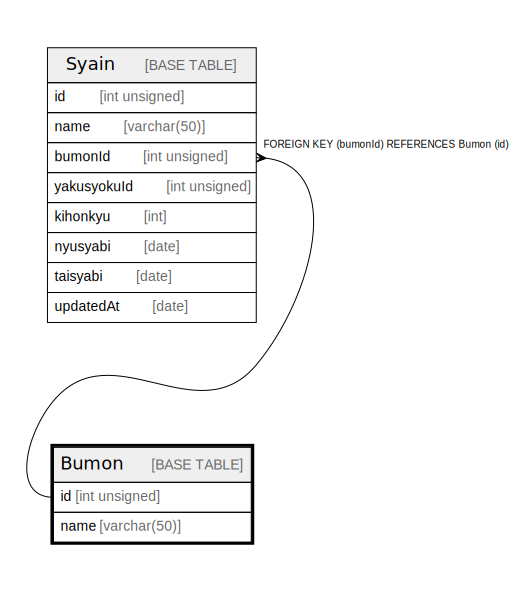

# Bumon

## Description

<details>
<summary><strong>Table Definition</strong></summary>

```sql
CREATE TABLE `Bumon` (
  `id` int unsigned DEFAULT NULL,
  `name` varchar(50) DEFAULT NULL
) ENGINE=InnoDB DEFAULT CHARSET=utf8mb4 COLLATE=utf8mb4_0900_ai_ci
```

</details>

## Columns

| Name | Type | Default | Nullable | Children | Parents | Comment |
| ---- | ---- | ------- | -------- | -------- | ------- | ------- |
| id | int unsigned |  | true |  |  |  |
| name | varchar(50) |  | true |  |  |  |

## Relations



---

> Generated by [tbls](https://github.com/k1LoW/tbls)
