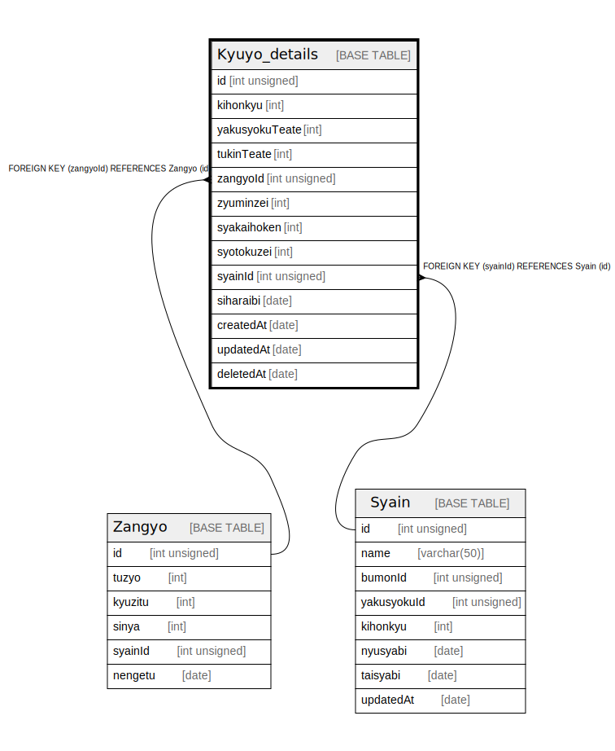

# Kyuyo_details

## Description

<details>
<summary><strong>Table Definition</strong></summary>

```sql
CREATE TABLE `Kyuyo_details` (
  `id` int unsigned DEFAULT NULL,
  `kihonkyu` int DEFAULT NULL,
  `yakusyokuTeate` int DEFAULT NULL,
  `tukinTeate` int DEFAULT NULL,
  `zangyoId` int unsigned DEFAULT NULL,
  `zyuminzei` int DEFAULT NULL,
  `syakaihoken` int DEFAULT NULL,
  `syotokuzei` int DEFAULT NULL,
  `syainId` int unsigned DEFAULT NULL,
  `siharaibi` date DEFAULT NULL,
  `createdAt` date DEFAULT NULL,
  `updatedAt` date DEFAULT NULL,
  `deletedAt` date DEFAULT NULL
) ENGINE=InnoDB DEFAULT CHARSET=utf8mb4 COLLATE=utf8mb4_0900_ai_ci
```

</details>

## Columns

| Name | Type | Default | Nullable | Children | Parents | Comment |
| ---- | ---- | ------- | -------- | -------- | ------- | ------- |
| id | int unsigned |  | true |  |  |  |
| kihonkyu | int |  | true |  |  |  |
| yakusyokuTeate | int |  | true |  |  |  |
| tukinTeate | int |  | true |  |  |  |
| zangyoId | int unsigned |  | true |  |  |  |
| zyuminzei | int |  | true |  |  |  |
| syakaihoken | int |  | true |  |  |  |
| syotokuzei | int |  | true |  |  |  |
| syainId | int unsigned |  | true |  |  |  |
| siharaibi | date |  | true |  |  |  |
| createdAt | date |  | true |  |  |  |
| updatedAt | date |  | true |  |  |  |
| deletedAt | date |  | true |  |  |  |

## Relations



---

> Generated by [tbls](https://github.com/k1LoW/tbls)
