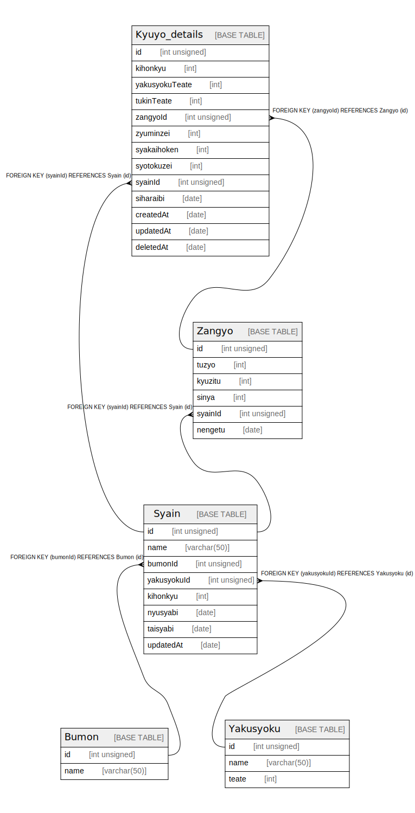

# kyuyoCulculateService

## Tables

| Name | Columns | Comment | Type |
| ---- | ------- | ------- | ---- |
| [Bumon](Bumon.md) | 2 |  | BASE TABLE |
| [Kyuyo_details](Kyuyo_details.md) | 13 |  | BASE TABLE |
| [Syain](Syain.md) | 8 |  | BASE TABLE |
| [Yakusyoku](Yakusyoku.md) | 3 |  | BASE TABLE |
| [Zangyo](Zangyo.md) | 6 |  | BASE TABLE |

## Relations

---

> Generated by [tbls](https://github.com/k1LoW/tbls)
